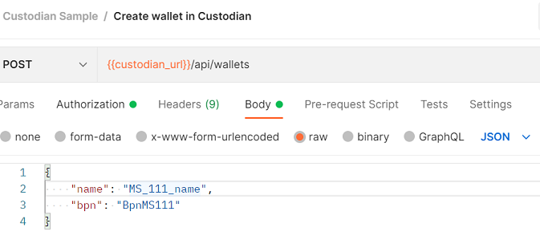
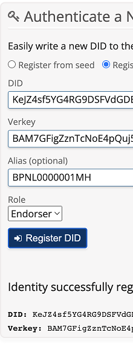
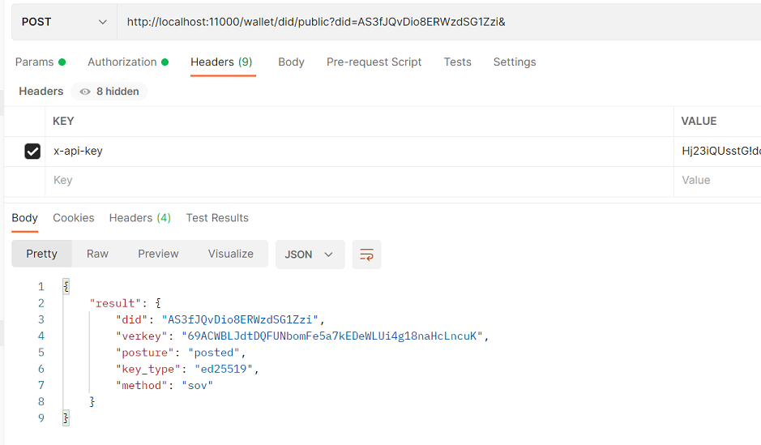
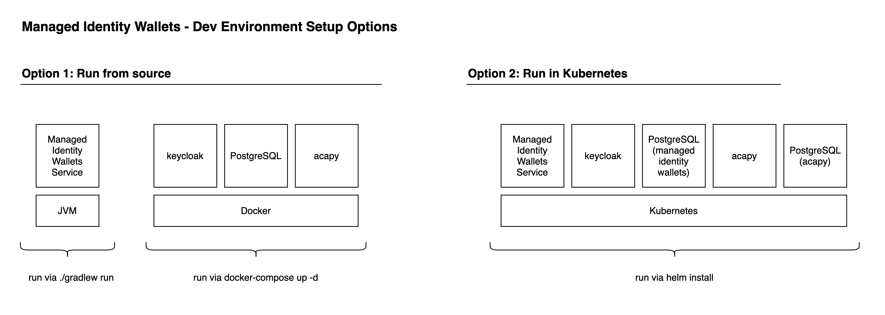

# Catena-X Core Managed Identity Wallets <a id= "introduction"></a>

This repository is part of the overarching Catena-X project, and more specifically
developed within the Catena-X Core Agile Release Train.

The Managed Identity Wallets service implements the Self-Sovereign-Identity (SSI)
readiness by providing a wallet hosting platform including a DID resolver,
service endpoints and the company wallets itself.

Technically this project is developed using the [ktor](https://ktor.io) Microservices
framework and thus the Kotlin language. It is using [gradle](https://gradle.org/) as
build system.

# Table of contents

1. [Introduction](#introduction)
2. [Used Technologies](#usedtechnologies)
3. [Local Deployment Toolstack](#deploymentwithIntellij)
4. [Steps for initial lokal Deployment and Wallet Creation](#initialDeploymentandWalletCreation)
5. [Building with gradle](#buildingWithGradle)
6. [Running locally with gradle (MacOS)](#runningLocallyWithGradle)
   1. [Under IntelliJ](#underIntelliJ)
7. [Building and running the Docker image](#buildingAndRunningTheDockerImage)
8. [Environment variable setup](#environmentVariableSetup)
9. [Local development environment](#localDevelopmentEnvironment)
    1. [Aca-Py Docker Image](#acapyDockerImage)
    2. [Start up Docker Containers for Postgres, Keycloak and AcaPy](#startupDockerContainers)
    3. [IntelliJ Development Setup](#intellijDevelopmentSetup)
    4. [Initial Wallet Setup](#initialWalletSetup)
10. [Testing GitHub actions locally](#testingGitHubActionsLocally)
11. [Setting up progresql database](#settingUpPostgresSqlDatabase)
12. [Dashboard](#dashboard)
13. [Future](#future)
14. [Further Notes](#furtherNotes)
15. [Helm Setup and Auto Deployment](#helmSetupAndAutoDeployment)

## Used technologies in this Project <a id= "usedtechnologies"></a>

- ACA-Py (Aries Cloud Agent Python) https://github.com/hyperledger/aries-cloudagent-python
    * specifially the multi-tenant feature https://github.com/hyperledger/aries-cloudagent-python/blob/main/Multitenancy.md)
    * and the JSON-LD credential https://github.com/hyperledger/aries-cloudagent-python/blob/main/JsonLdCredentials.md)
- Hyperledger Indy https://hyperledger-indy.readthedocs.io/en/latest/
- Ktor Framework https://ktor.io/

## Local Deployment Toolstack <a id= "deploymentwithIntellij"></a>

- Intellij - https://www.jetbrains.com/de-de/idea/download/
- Postman - https://www.postman.com/downloads/
- Docker - https://www.docker.com/products/docker-desktop/
- DBeaver - https://dbeaver.io/
- Gradle - https://gradle.org/install/
  
## Steps for initial lokal Deployment and Wallet Creation <a id= "initialDeploymentandWalletCreation"></a>

1. Clone the Github Repository - https://github.com/catenax-ng/product-core-managed-identity-wallets.git
2. Clone the [Aca-Py Docker Image](#acapyDockerImage)
3. Copy .env.example and rename to dev.env see section [IntelliJ Development Setup](#intellijDevelopmentSetup)
4. Start Docker-Compose Up for deployment of Keycloack, Acapy and Postgres, see section [Startup Docker Containers](#startupDockerContainers)
5. Setup Postgres Connection in DBeaver with Credentials -postgres, -cx_password on port 5432, see section [Setting up progresql database](#settingUpPostgresSqlDatabase)
    1. Add the postgres settings to dev.env and comment out the h2-settings also in section
    2. Create miwdev Database
6. Add the miwdev Database connection to DBeaver
7. Run `application.kt` in IntelliJ or in your IDE or run it on the command line (`set -a; source dev.env; set +a` and `./gradlew run`)
8. Start Postman and add the Environment and the collection from ./dev-assets/
    1. In the body of *Create wallet in Managed Identity Wallets*, change the `bpn` value to your `CX_BPN`
       1. 
    2. Execute the request and note down your `did` and `verKey` from the response
       1. 
9. Register public DID
    1. Register your DID from your Wallet at https://indy-test.bosch-digital.de/ with "Register from DID"
       1. 
    2. Post your created wallets with your DID to `http://localhost:11000/wallet/did/public?did=` + (your DID without the prefix e.g. `AS3fJQvDio8ERWzdSG1Zzi`)
       1. 
    3. Add as authorization a Bearer Token (from the `miwdev` database take the content of `wallet_token` from the `wallets` table)
       1. 
    4. Add as `X-API-Key` header your `ACAPY_ADMIN_API_KEY` env variable value
11. Now you have created your own Wallet and published your DID to the Ledger, you can retrieve the list of wallets in Postman via the *Get wallets from Managed Identity Wallets*

## Building with gradle <a id= "buildingWithGradle"></a>

To install gradle just follow [the official guide](https://gradle.org/install/), e.g. on MacOS homebrew can be used:

```
brew install gradle
```

Building then works with

```
gradle build
```

Or, as we also use gradle in the CI/CD pipeline, the gradle wrapper can be used

```
./gradlew build
```

In the following the `gradle` commands are using the gradle wrapper `gradlew`.

## Running locally with gradle (MacOS) <a id= "runningLocallyWithGradle"></a>

Copy the file `.env.example` and rename it to `dev.env`

```
set -a; source dev.env; set +a
./gradlew run
```
### Under Intellij <a id= "underIntelliJ"></a>

Download the Intellij envFile Plugin, copy the file `.env.example` and rename it to `dev.env`

## Building and running the Docker image <a id= "buildingAndRunningTheDockerImage"></a>

Based on the [official documentation](https://ktor.io/docs/docker.html#getting-the-application-ready)
below the steps to build and run this service via Docker.

First step is to create the distribution of the application (in this case using Gradle):

```
./gradlew installDist
```

Next step is to build and tag the Docker image:

```
docker build -t catena-x/managed-identity-wallets:<placeholder> .
```

Finally, start the image (please make sure that there are no quotes around the
values in the env file):

```
docker run --env-file .env.docker -p 8080:8080 catena-x/managed-identity-wallets:<placeholder>
```

## Environment variable setup <a id= "environmentVariableSetup"></a>

Please see the file `.env.example` for the environment examples that are used
below. Here a few hints on how to set it up:

1. `CX_DB_JDBC_URL`: enter the database url, default is `jdbc:h2:mem:miwdev;DB_CLOSE_DELAY=-1;`
2. `CX_DB_JDBC_DRIVER`: enter the driver, default is `org.h2.Driver`
3. `CX_AUTH_JWKS_URL`: enter the keycloak certs url, e.g. `http://localhost:8081/auth/realms/catenax/protocol/openid-connect/certs`
4. `CX_AUTH_ISSUER_URL`: enter the token issue, e.g. `http://localhost:8081/auth/realms/catenax`
5. `CX_AUTH_REALM`: specify the realm, e.g. `catenax`
6. `CX_AUTH_ROLE`: specify the expected role within the token, e.g. `access`
7. `CX_AUTH_CLIENT_ID`: specify the expected client id, e.g. `managed-identity-wallets`
8. `CX_DATAPOOL_URL`: specify the data pool API endpoint, e.g. `http://catenax-bpdm-dev.germanywestcentral.cloudapp.azure.com:8080`
9. `APP_VERSION`: specify the application version, e.g. `0.0.10` note that github actions replace the value before the helm deployment
10. `ACAPY_API_ADMIN_URL`: specify the admin url of Aca-Py, e.g. `http://localhost:11000`
11. `ACAPY_LEDGER_URL`: specify the indy ledger url for registeration, e.g.`https://indy-test.bosch-digital.de/register`
12. `ACAPY_NETWORK_IDENTIFIER`: specify the name space of indy ledger, e.g. `local:test`
13. `ACAPY_ADMIN_API_KEY`: specify the admin api key of Aca-Py enpoints, e.g. `Hj23iQUsstG!dde`
14. `CX_BPN`: specify the bpn of the catenaX wallet, e.g. `Bpn111` This wallet should be the first wallet to create.

## Local development environment <a id= "localDevelopmentEnvironment"></a>

To resemble the staging and production system as much as possible also on the
local machine, an external Postgresql database should be used instead of
the default included h2 in-memory database. Additionally the authentication and authorization could be done via
[keycloak](https://www.keycloak.org).

There are two ways to set up the local environment:
1. *Run from source*: using keycloak and postgres as stand-alone docker containers and running the managed identity wallets service via gradle, or 
2. *Run in Kubernetes*: packaging all of the services and run them on a local kubernetes cluster



### Preperation of Aca-Py Docker Image <a id= "acapyDockerImage"></a>

Building the Aca-Py image is necessary for both setup options:
* clone the repository `git clone https://github.com/hyperledger/aries-cloudagent-python.git`
* navigate to the repository `cd aries-cloudagent-python`
* currently tested with commit `0.7.4-rc1` from April, 28, 2022
* run `git checkout 0.7.4-rc1`
* run `docker build -t acapy:0.7.4-rc1 -f ./docker/Dockerfile.run .`

### Preparation of Managed Identity Wallet Docker Image

Building the service image is necessary for both setup options, it is recommended
to use as version tag the version specified in `gradle.properties`:

```
./gradlew installDist
docker build -t catena-x/managed-identity-wallets:<placeholder> .
```

### Option 1: Run from source <a id= "startupDockerContainers"></a>

Starting up Docker Containers for Postgres, Keycloak and AcaPy via following steps:

* navigate to `./dev-assets/dev-containers`
* run `docker-compose up -d` (or `docker compose up -d`, depdending on the installation) to start a Postgresql database and Keycloak instance and the AcaPy Service as Docker containers
* To setup the Postgresql database in the application please see the section below - [Setting up progresql database](#settingUpPostgresSqlDatabase), for the database
* The keycloak configuration are imported from `./dev-assets/dev-containers/keycloak` in the docker compose file.
* Keycloak is reachable at `http://localhost:8081/` with `username: admin` and `password: catena`
* The new realm of keycloak could also be manually added and configured at http://localhost:8081 via the "Add realm" button. It can be for example named `catenax`. Also add an additional client, e.g. named `ManagedIdentityWallets` with *valid redirect url* set to `http://localhost:8080/*`. A role, e.g. named `managed-identity-wallets-api` and a user, e.g. named `managed-identity-wallets-admin`, need to be created as well (including setting a password, e.g. `catena-x`). The user also needs to have a specific client role assigned, e.g. `access`, which is validated on access time. The instructions were taken from [this medium blog post](https://medium.com/slickteam/ktor-and-keycloak-authentication-with-openid-ecd415d7a62e).

Finally run the managed identity wallets service via

```
./gradlew run
```

or respectively in your IDE.
### Option 2: Run in Kubernetes

*Work in progress*

1. Create a namespace

Using as example `managed-identity-wallets`:

```
kubectl create namespace managed-identity-wallets
```

2. Create relevant secrets

Altogether four secrets are needed
* catenax-managed-identity-wallets-secrets
* catenax-managed-identity-wallets-acapy-secrets
* postgres-acapy-secret-config
* postgres-managed-identity-wallets-secret-config

Create these with following commands, after replacing the placeholders:

```
kubectl -n managed-identity-wallets create secret generic catenax-managed-identity-wallets-secrets \
  --from-literal=cx-db-jdbc-url='jdbc:postgresql://<placeholder>:5432/miwdev?user=miwdevuser&password=<placeholder>' \
  --from-literal=cx-auth-client-id='ManagedIdentityWallets' \
  --from-literal=cx-auth-client-secret='<placeholder>'

kubectl -n managed-identity-wallets create secret generic catenax-managed-identity-wallets-acapy-secrets \
  --from-literal=acapy-wallet-key='<placeholder>' \
  --from-literal=acapy-agent-wallet-seed='<placeholder>' \
  --from-literal=acapy-jwt-secret='<placeholder>' \
  --from-literal=acapy-db-account='postgres' \
  --from-literal=acapy-db-password='<placeholder>' \
  --from-literal=acapy-db-admin='postgres' \
  --from-literal=acapy-db-admin-password='<placeholder>' \
  --from-literal=acapy-admin-api-key='<placeholder>'

kubectl -n managed-identity-wallets create secret generic postgres-acapy-secret-config \
--from-literal=password='<placeholder>' \
--from-literal=postgres-password='<placeholder>' \
--from-literal=user='postgres'

kubectl -n managed-identity-wallets create secret generic postgres-managed-identity-wallets-secret-config \
--from-literal=password='<placeholder>' \
--from-literal=postgres-password='<placeholder>' \
--from-literal=user='postgres'
```

3. Install a new deployment via helm

Run following command to use the base values as well as the predefined values for local deployment:

```
helm install managed-identity-wallets ./helm/managed-identity-wallets/ -n managed-identity-wallets -f ./helm/managed-identity-wallets/values.yaml -f ./helm/managed-identity-wallets/values-local.yaml
```

4. Expose via loadbalancer

```
kubectl -n managed-identity-wallets apply -f dev-assets/kube-local-lb.yaml
```

### IntelliJ Development Setup <a id= "intellijDevelopmentSetup"></a>

To run and develop using IntelliJ IDE:
* open the IntelliJ IDE and import the project
* create file `dev.env` and copy the values from `.env.example`
* install the plugin `Env File` https://plugins.jetbrains.com/plugin/7861-envfile
* Run `Application.kt` after adding the `dev.env` to the Run/Debug configuration

### Initial Wallet Setup <a id= "initialWalletSetup"></a>

* Create the Catena-X wallet using the value stored in `CX_BPN` as BPN
* Register the DID of Catena-X Wallet and its VerKey on the ledger [Register from DID](https://indy-test.bosch-digital.de/) as Endorser
* Assign the DID to public manually by sending a Post request `http://localhost:11000/wallet/did/public?did=<did-identifier-place-holder>` using the wallet token and the admin api key in the header
```
    Authorization: "Bearer <WalletToken-placeholder>" 
    X-API-Key: "<AdminApiKey-Placeholder>"
```

## Testing GitHub actions locally <a id= "testingGitHubActionsLocally"></a>

Using [act](https://github.com/nektos/act) it is possible to test GitHub actions
locally. To run it needs a secrets file, which could be derived on `.env.example`,
see the section above.

```
act --secret-file .env
```
## Setting up progresql database <a id="settingUpPostgresSqlDatabase"></a>

Based on the [documentation](https://docs.microsoft.com/en-us/azure/postgresql/howto-create-users)
provided by Mirosoft following SQL needs to be executed to setup initiall the database:

```
CREATE DATABASE miwdev;
CREATE ROLE miwdevuser WITH LOGIN NOSUPERUSER INHERIT CREATEDB NOCREATEROLE NOREPLICATION PASSWORD '^cXnF61qM1kf';
GRANT CONNECT ON DATABASE miwdev TO miwdevuser;
```

Then following environment settings in your local environment file (potentially
named `dev.env`) can be used:

```
CX_DB_JDBC_URL="jdbc:postgresql://localhost:5432/miwdev?user=miwdevuser&password=^cXnF61qM1kf"
CX_DB_JDBC_DRIVER="org.postgresql.Driver"
```

Currently the ORM Exposed is creating the tables if they don't exist yet, done
within the `Persistence.kt` database setup:

```
SchemaUtils.createMissingTablesAndColumns(Companies, Wallets, VerifiableCredentials)
```

## Dashboard <a id="dashboard"></a>

Within `ui-src` a simple Vue based dashboard application is available
which currently only shows the existing companies as well as is able
to retrieve the full BPN information from the CX data pool API on a
click on the BPN.

It can be developed with

```
cd ui-src
yarn serve
```

In each release the files in `/static` are updated but within the deployment
pipeline the application is built and copied over to the `/static` directory.

The steps to build the static files are like following:

```
cd ui-src
yarn build
rm -rf ../static/*
cp -r dist/* ../static
```

## Future <a id="future"></a>

Potentially following libraries and frameworks could be added in future

* [HikariCP](https://github.com/brettwooldridge/HikariCP) for connection pooling
* [Koin](https://github.com/InsertKoinIO/koin) for dependency injection

------

# Further notes <a id= "furtherNotes"></a>

Deployment to be adjusted to the ArgoCD deployment, below notes are just for reference

## Helm Setup and Auto Deployment <a id= "helmSetupAndAutoDeployment"></a>
The Helm setup is configured under `helm/managed-identity-wallets` and used by `github-actions` for auto deployment. Before pushing to the `develop` branch, please check if the version of the `gradle.properties` need to be updated, the Aca-Py image is uploaded as described [section](##Aca-Py_Build_and_ Upload_Image) and the secret files and `values-staging.yaml` sill accurate.

* To check the current deployment and version run `helm list -n <namespace-placeholder>`. Example output:
```
NAME         	NAMESPACE        	REVISION	UPDATED                                	STATUS  	CHART                  	                APP VERSION
cx-miw       	ingress-miw     	1       	2022-02-24 08:51:39.864930557 +0000 UTC	deployed	catenax-managed-identity-wallets-0.1.0	0.0.5      
```

The deployment requires also a secret file `catenax-managed-identity-wallets-secrets` that include the following data:
1. `cx-db-jdbc-url` (includes password/credentials for DB access)
1. `cx-auth-client-id`
1. `cx-auth-client-secret`

To add a secret file to the namespace in the cluster:
* login to AKS
* either import them using a file `kubectl -n <namespace-placeholder> create secret generic catenax-managed-identity-wallets-secrets --from-file <path to file>`
* or run the following command after replaceing the placeholders
```
  kubectl -n <namespace-placeholder> create secret generic catenax-managed-identity-wallets-secrets \
  --from-literal=cx-db-jdbc-url='<placeholder>' \
  --from-literal=cx-auth-client-id='<placeholder>' \
  --from-literal=cx-auth-client-secret='<placeholder>'
```

Aca-py will be deployed and connected to a postgres database pod in the same namespace. The postgres database is deployed using the following [instructions](https://www.sumologic.com/blog/kubernetes-deploy-postgres/) The used files can be found under `dev-assets/acapy-postgres` without adding a Service. The IP of the acapy-postgres pod should be updated in the `values-staging.yaml` whenever the postgres pod is changed

The deployment of AcaPy instance requires also a secret file `catenax-managed-identity-wallets-acapy-secrets` that include the following data:
1. `acapy-wallet-key` the key of the base wallet
1. `acapy-agent-wallet-seed` the seed of the base wallet
1. `acapy-jwt-secret` the jwt secret for the tokens
1. `acapy-db-account` postgres account
1. `acapy-db-password` postgres password
1. `acapy-db-admin` postgres admin
1. `acapy-db-admin-password` postgres admin password
1. `acapy-admin-api-key` the admin api key used by the managed identity wallets and acapy instance
```
kubectl -n <namespace-placeholder> create secret generic catenax-managed-identity-wallets-acapy-secrets \
  --from-literal=acapy-wallet-key='<placeholder>' \
  --from-literal=acapy-agent-wallet-seed='<placeholder>' \
  --from-literal=acapy-jwt-secret='<placeholder>' \
  --from-literal=acapy-db-account='<placeholder>' \
  --from-literal=acapy-db-password='<placeholder>' \
  --from-literal=acapy-db-admin='<placeholder>' \
  --from-literal=acapy-db-admin-password='<placeholder>' \
  --from-literal=acapy-admin-api-key='<placeholder>'
```

* To check if the secrets stored correctly run `kubectl -n <namespace-placeholder> get secret/catenax-managed-identity-wallets-secrets -o yaml`
* To check if the secrets stored correctly run `kubectl -n <namespace-placeholder> get secret/catenax-managed-identity-wallets-acapy-secrets -o yaml`


